<center>

# Task Master

</center>

## Task Master — Bring Order to Your Day!

With Task Master, managing your tasks becomes effortless. Enjoy a smooth, intuitive experience that helps you stay organized and in control—every day, on any device."

#### In case you get lazy:(👇)

> Admin credentials:
> email:admin@gmail.com
> Password: password

> Normal User credentials:
> email: hanmabaki@gmail.com
> password: password

> Verify OTP:(Just use this)
> OTP is 123456

### What it does? Check for yourself

## Project Screenshots

| Hero Section (Dark mode)                     | Hero Section                               |
| -------------------------------------------- | ------------------------------------------ |
| 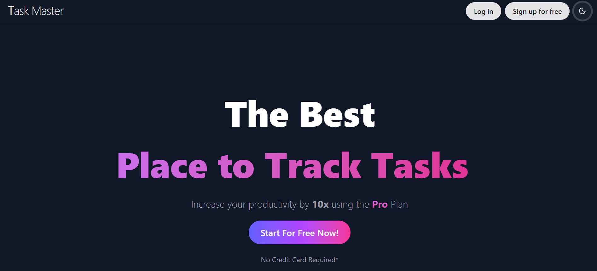 | 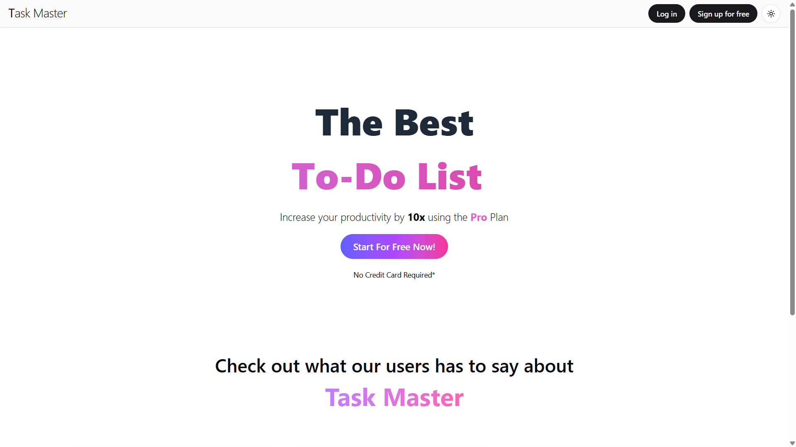 |

| Login (Dark mode)                     | Login (With Form Validation)           |
| ------------------------------------- | -------------------------------------- |
| 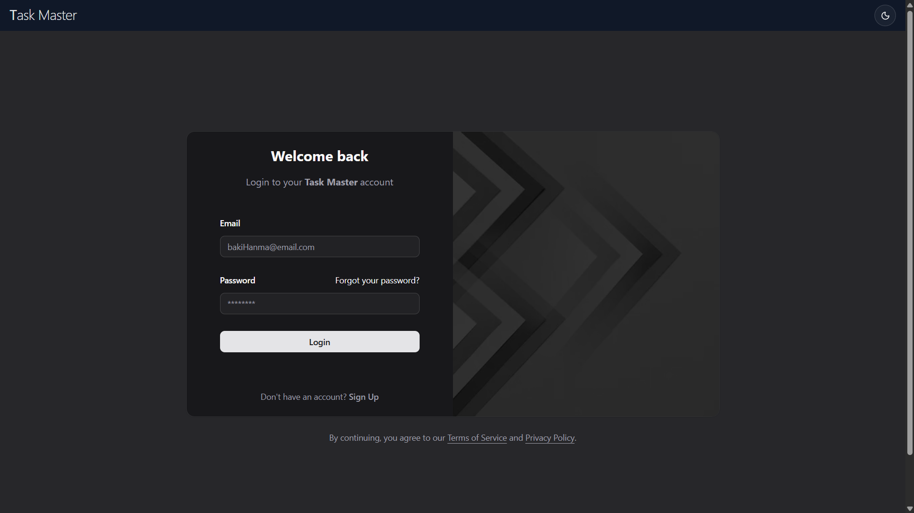 | 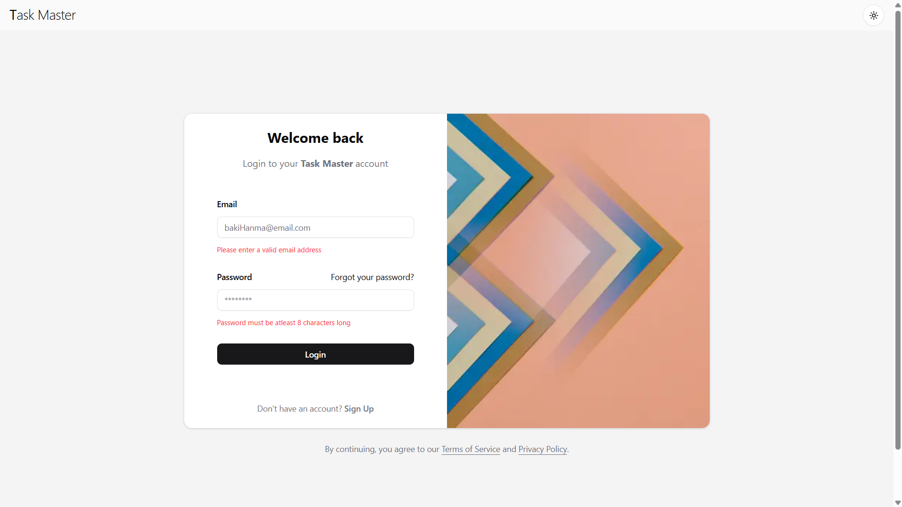 |

| Signup(form validations)                  | signup (loading)                          |
| ----------------------------------------- | ----------------------------------------- |
| 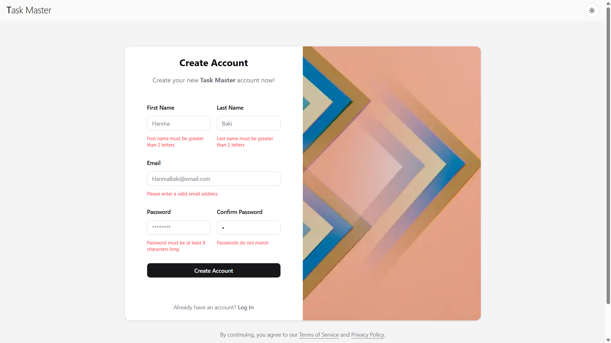 |  |

| login(loading)                            | Dashboard (With Data-Table)               |
| ----------------------------------------- | ----------------------------------------- |
| 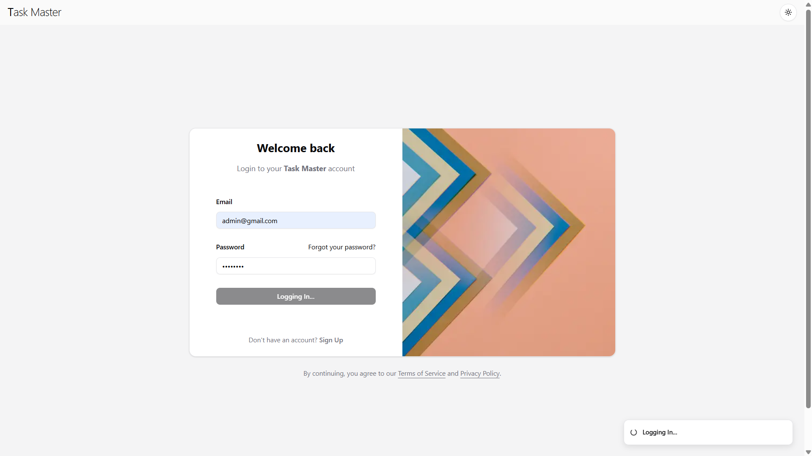 | 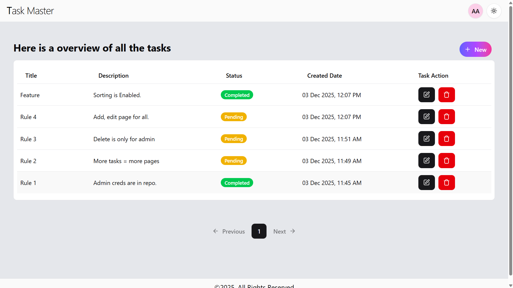 |

| Dashboard(Admin View)                     | Create Task                                |
| ----------------------------------------- | ------------------------------------------ |
| 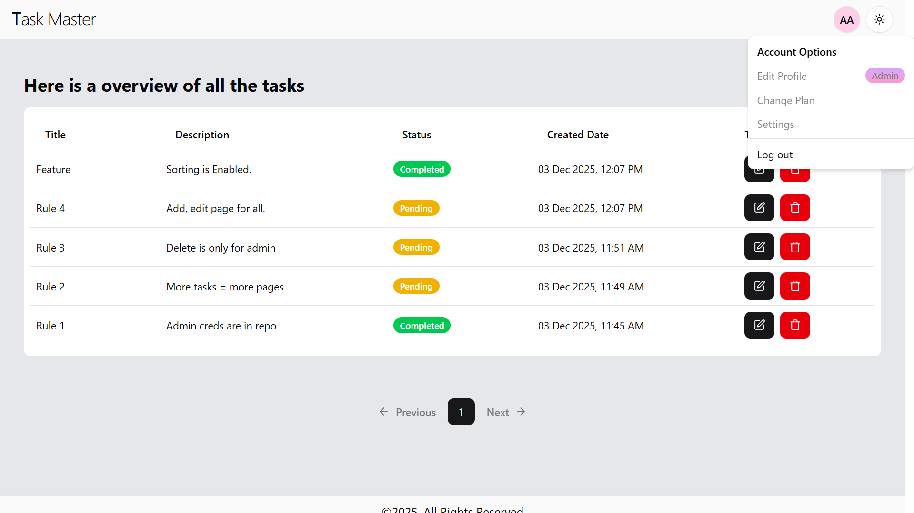 | 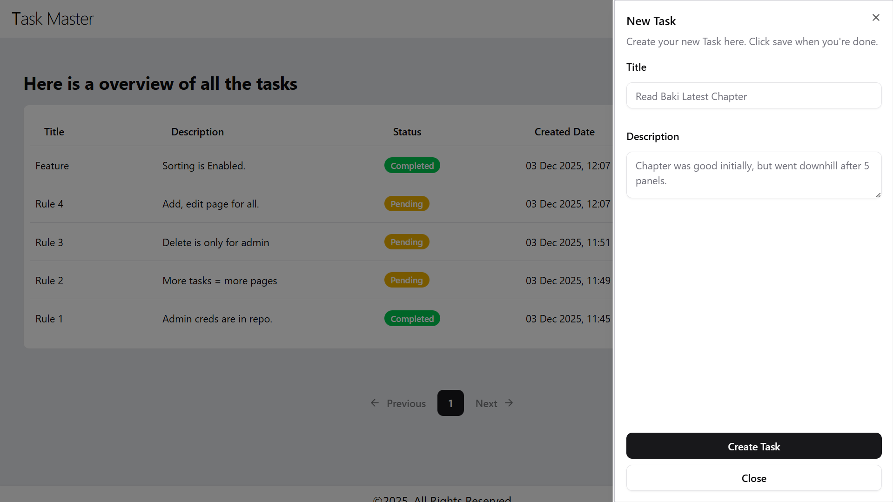 |

| Create Sucessful                           | Delete Alert                               |
| ------------------------------------------ | ------------------------------------------ |
| 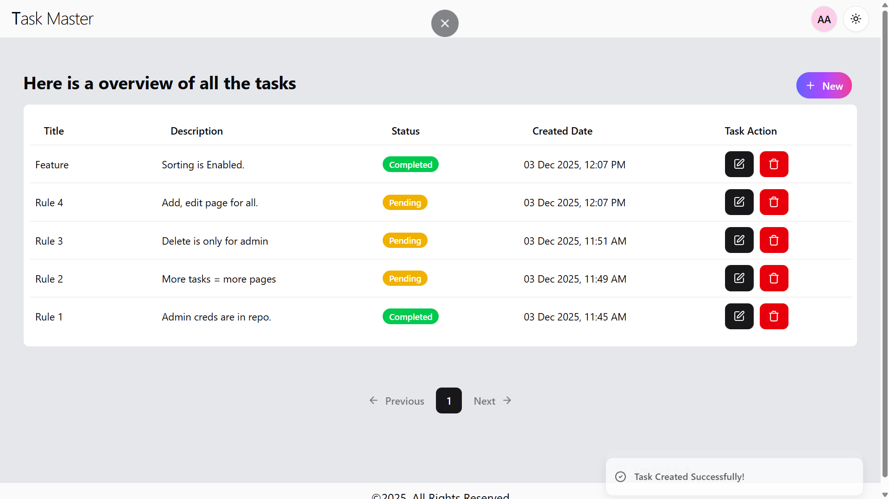 | 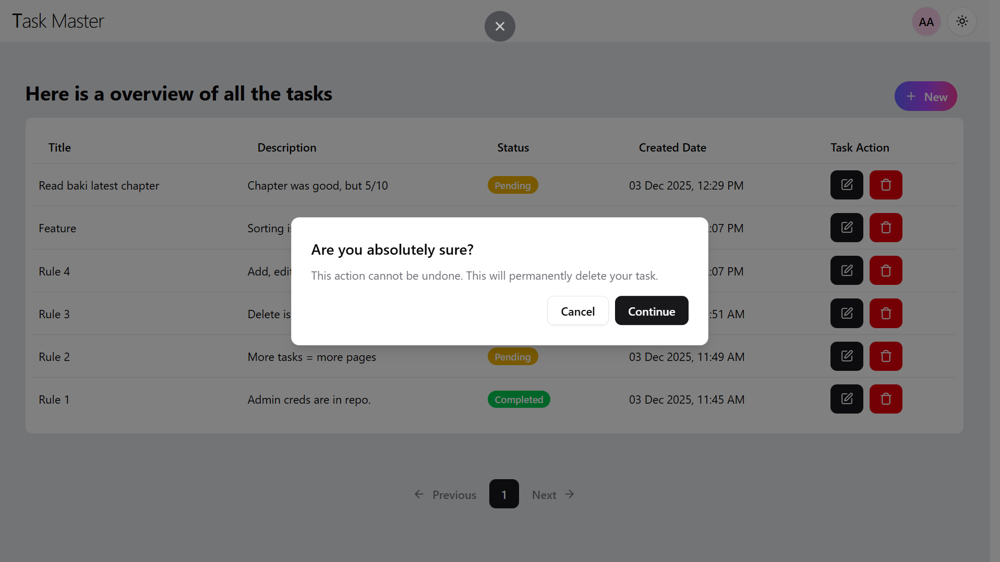 |

| Delete Sucessful                           | Edit Task                                  |
| ------------------------------------------ | ------------------------------------------ |
| 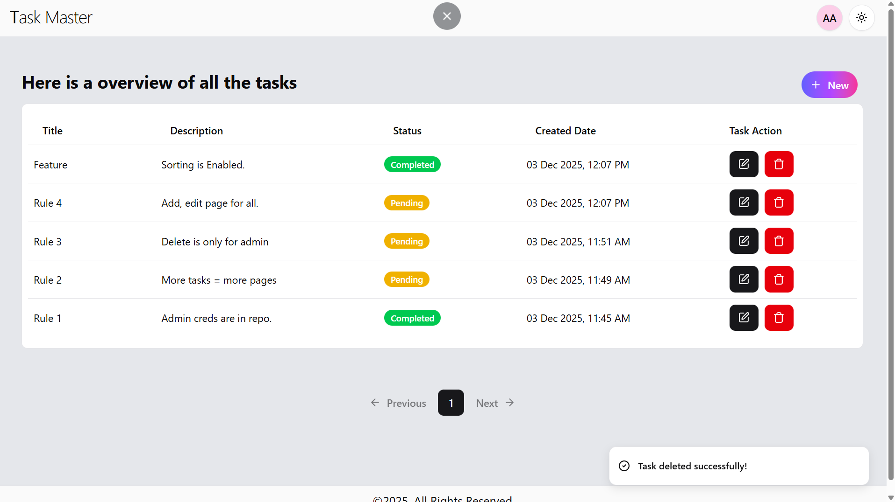 | 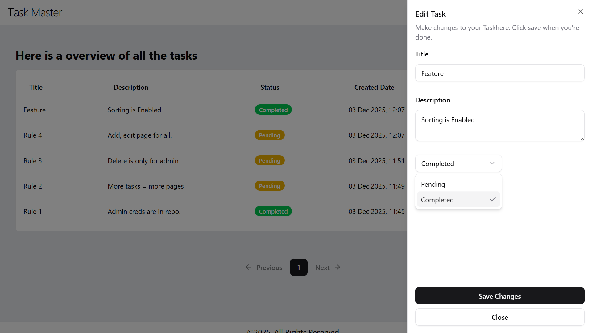 |

| Signup Page (Empty)                        | OTP Verification                           |
| ------------------------------------------ | ------------------------------------------ |
| 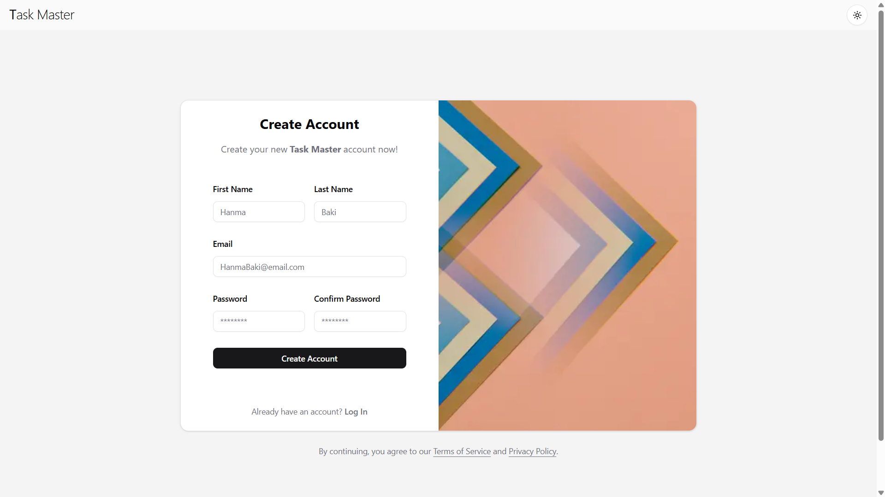 | 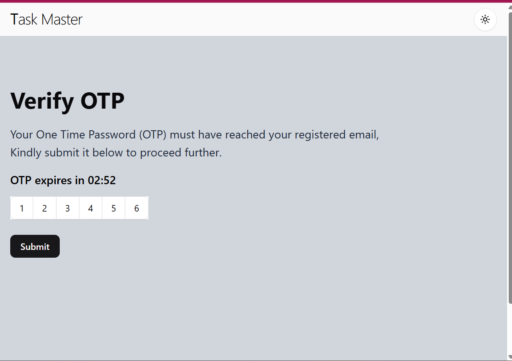 |

| Signup Sucessful (OTP Verified)            |
| ------------------------------------------ |
| 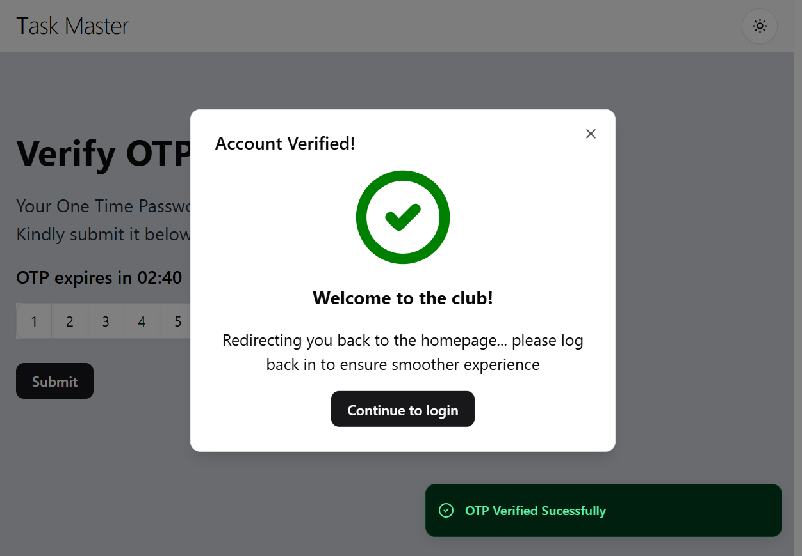 |

## Features

- Advanced Authentication System:
- Encrpyted passwords using bcrypt.
- login, signup, verifyOTP functionality.
- OTP-enabled email verification (disabled due to vercel limitations)
- HTTP-only secure cookies (disabled due to vercel limitations)
- JWT-based session handling.
- Zustand state management.
- App router.
- Route protection.
- Tanstack Table with sorting.
- Shadcn ui components with reusable structure.

## Tech Stack

#### Client:

- Nextjs 16
- Shadcn UI
- Tailwind
- Typescript
- Axios (API fetching mechanism)
- Tanstack Query (earlier called as react Query) (API state management).
- Tanstack Table
- Zustand (state management).
- Zod (Schema Validation)

#### Server:

- Nodejs
- Express
- JWT
- Node Mailer
- bcrypt
- http only cookies.

#### Database:

- MongoDB (Hosted MongoDB Atlas)

## Wanna Run in your Machine?

Clone the project

```bash
  git clone https://github.com/ShahbaazX786/task-master.git
```

Go to the project directory

```bash
  cd frontend
```

Install dependencies

```bash
  npm install
```

Start the server

```bash
  npm run z
```

## Environment Variables

To run this project, you will need to add the following environment variables to your .env file. As we have used expo to initialize this app so prefixing EXPO\_ is the way to go if you want to utilize the .env file.

## Feedback

##### If you have any feedback, please reach out to me in below ways:

- LinkedIn - https://www.linkedin.com/in/shaik-shahbaaz-alam/
- Github - Just Dm me or raise a PR.
- Twitter / X - https://twitter.com/shahbaazx24
- Email - shahbaazalam78@gmail.com

## Support

For support, you can star 🌟 this repo or follow me on my social handles.

### Further Updates:

- Persistent State.
  - Currently User / Auth state is not persistent and will be recreated if a browser refresh happens.
- Idle Session Timeout.
  - User currently get logged out instantly as soon as the token expires.
  - So a idle session timeout alert dialog will be added soon.
- Automatic Session Renewal.
  - Using Refresh Token API it is possible to refresh the token just minutes before the actual token expiry, so that user can continue working with no / less interruption.
- Sorting of Data from backend.
  - Currently the data is being sent in FIFO manner and there is no query to sort the data before hand in server so that pagination work as expected.
- Admin Role Invitation Link.
  - Currently the only way to assign a normal user admin authority is to just manually update it in the database.
  - However after the admin invitation email this can be automated.
- retry / refetch logic.
  - currently the retry logic is turned off. but it can be turned on to atleast 3 times so that we can conclude an error only after trying for a set amount of times.
